# S_funding
---
## 크라우드 펀딩 웹 프로젝트 
**스펀지** 처럼 **후원자**의 **요청**을 흡수하는 펀딩 사이트
- 크라우드 펀딩 : 
자금이 부족하거나 없는 사람들이 프로젝트를 인터넷에 공개하고 목표금액과 모금기간을 정하여 *익명의 다수*에게 투자를 받는 방식

- 개발 목표 :
창작자들은 후원자가 원하는 프로젝트를 구현, 후원자들은 원하는 펀딩을 요청하여 후원자와 창작자가 서로 소통할 수 있는 크라우드 펀딩 서비스 제공
---
## 구현 화면

- 로그인/회원가입
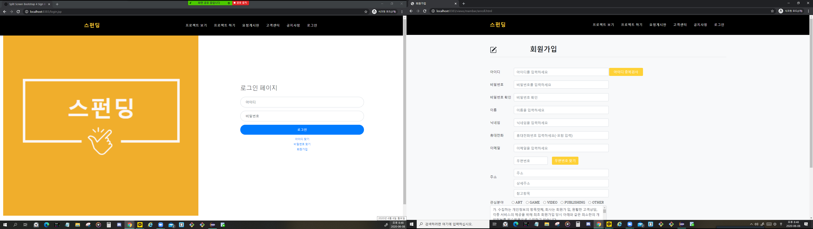

- 아이디 찾기/비밀번호 찾기
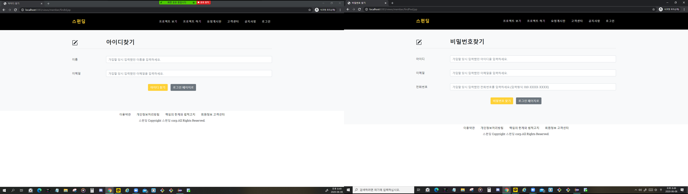

- 메인 페이지
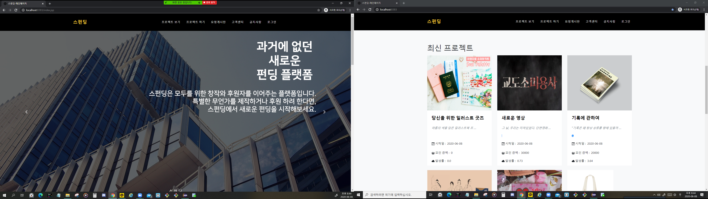
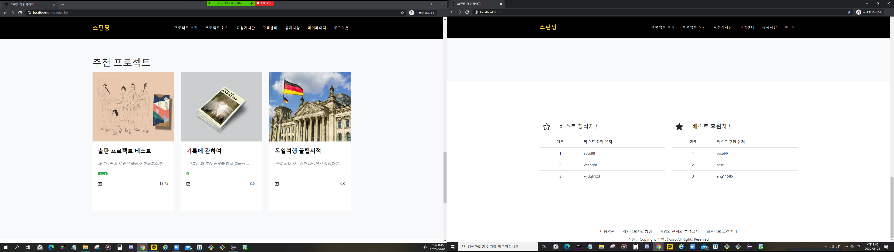

- 마이 페이지(사용자/관리자)
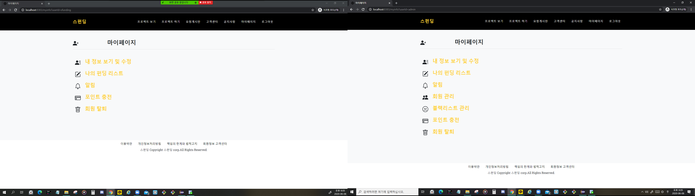
- 블랙리스트 관리(관리자)
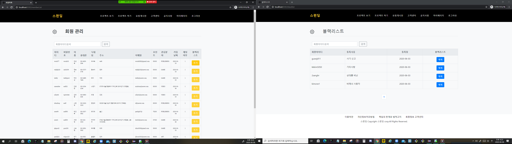
- 알람/내가 후원한 리스트(사용자)
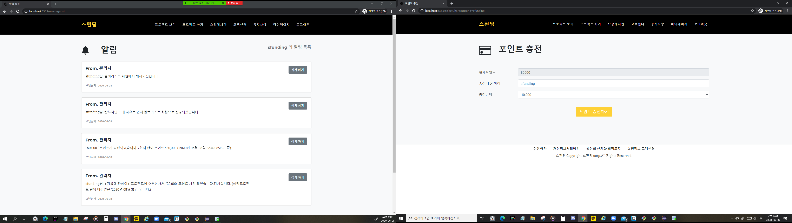

- 프로젝트 작성
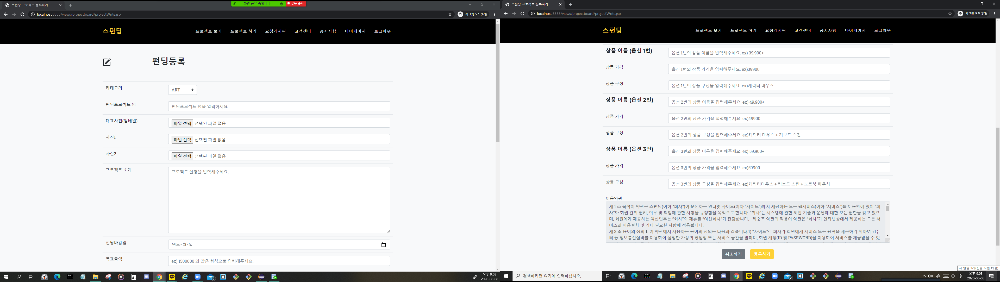
- 프로젝트 보기
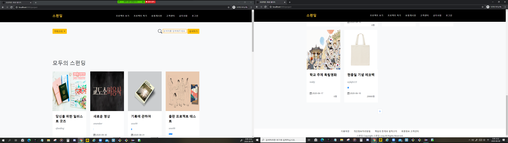
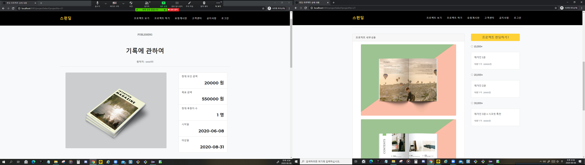
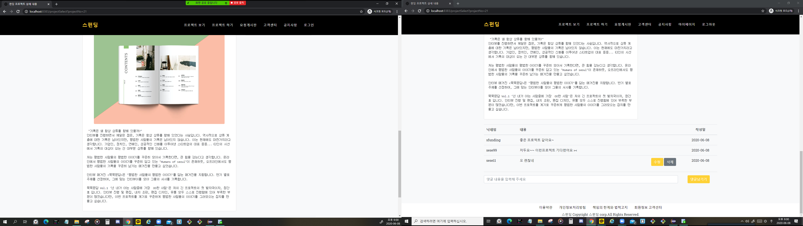
- 프로젝트 후언하기
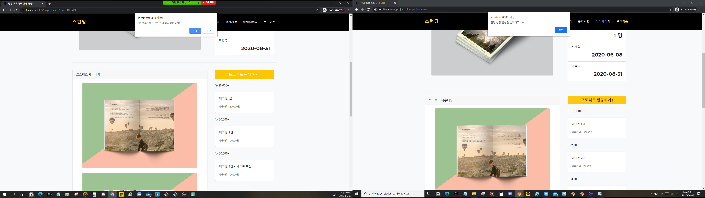

- 요청 게시판
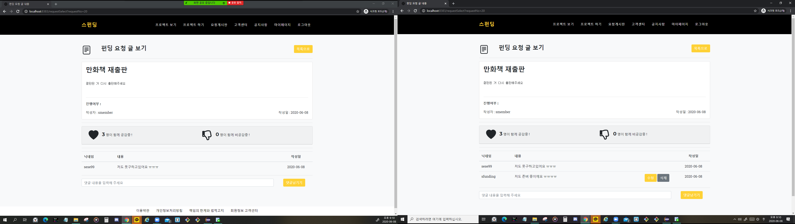

- 고객센터
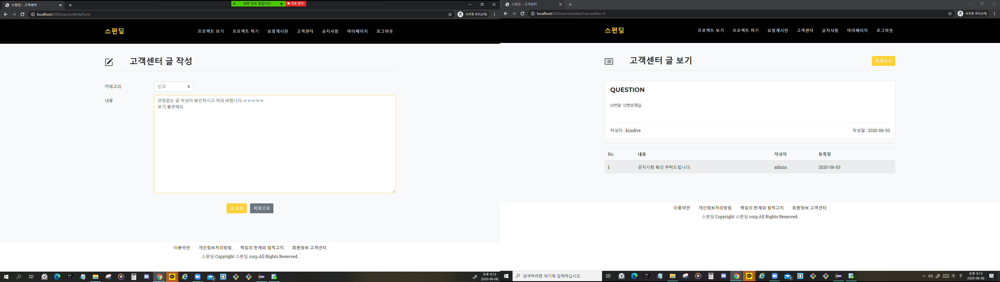

- 공지사항
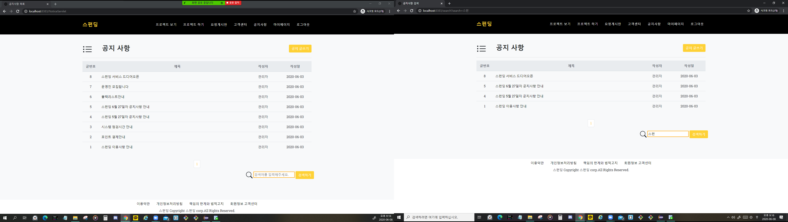

---
## 시연 영상
- [스펀딩 프로젝트](https://www.youtube.com/watch?v=6lJRiR4ETgY&feature=youtu.be)
---
## 개발 도구
- 이클립스
- 오라클
- HTML/CSS/JS
- jQuery
- Java
- Apache
